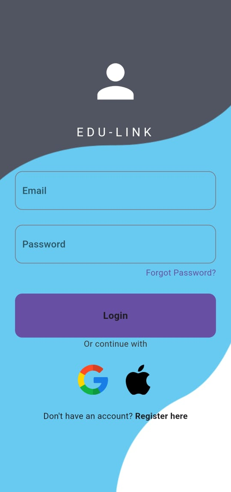
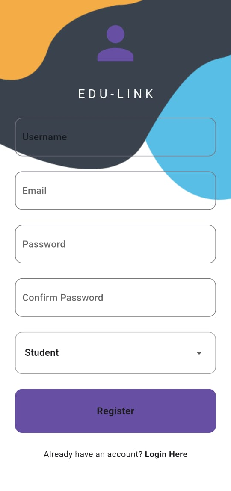
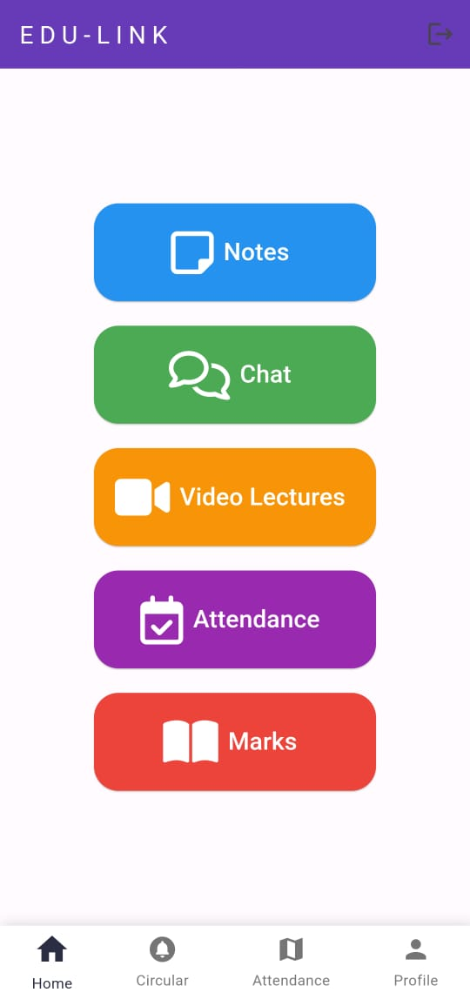
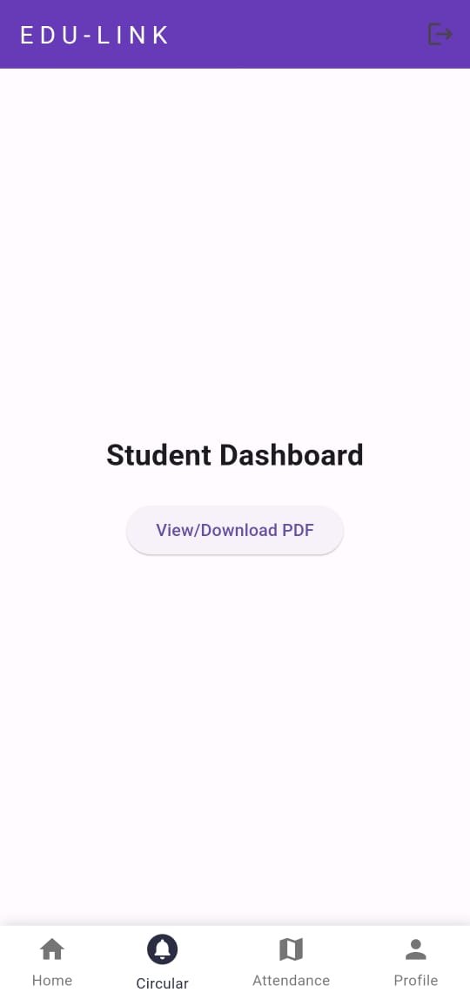
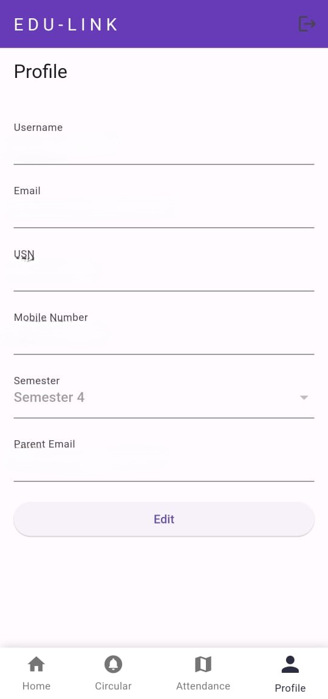
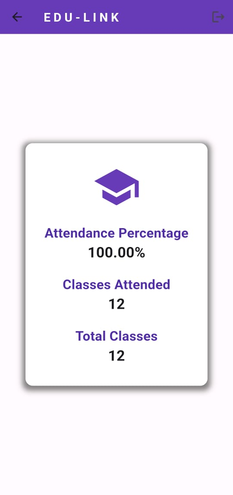
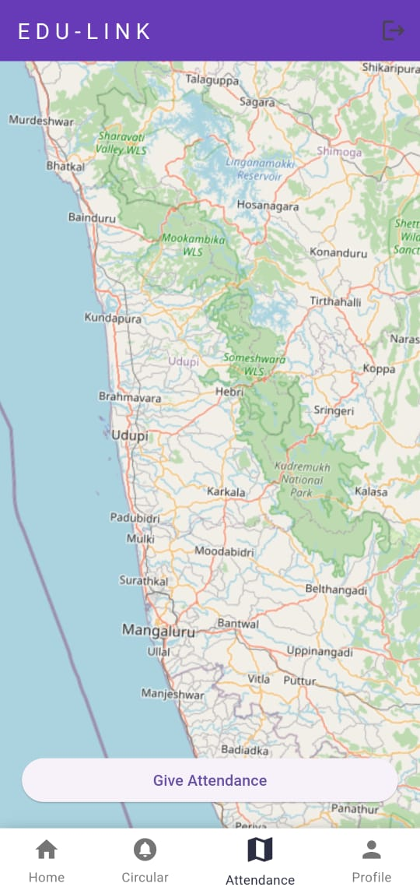

# Edu Link 📚

Edu Link is a comprehensive and user-friendly education management app designed to bridge the gap between students and teachers, creating a collaborative environment for learning, progress tracking, and communication. With an array of powerful features, Edu Link is the one-stop solution for students to access essential academic resources and monitor their performance with ease.

## 🌟 Key Features

- **Course Materials**: Access notes, video lectures, and various educational resources directly from the app to support continuous learning.
- **Chat Functionality**: Communicate with teachers instantly for guidance and academic support.
- **Attendance Tracking**: Keep track of attendance percentages and stay up-to-date with academic progress.
- **Performance Tracking**: Access detailed reports on marks, achievements, and overall academic performance.

## 🎯 Why Choose Edu Link?

Edu Link simplifies the academic journey by providing a centralized platform that consolidates critical resources, real-time communication, and performance insights. Designed with a modern interface, Edu Link empowers students to effectively manage their academic lives, foster engagement, and enhance the learning experience.

## 🛠️ Tech Stack

Edu Link leverages a robust tech stack to ensure seamless functionality and cross-platform compatibility:

- **Frontend**: Built with **Flutter**, allowing smooth performance on both iOS and Android devices.
- **Backend**: Powered by **Firestore** for real-time data synchronization, ensuring students and teachers have access to the most current information.

## 🚀 Getting Started

To run Edu Link on your local device, follow these steps:

1. **Clone the repository**:

    ```bash
    git clone https://github.com/Aniudupa15/edu_link.git
    ```

2. **Navigate into the project directory**:

    ```bash
    cd edu_link
    ```

3. **Install dependencies**:

    ```bash
    flutter pub get
    ```

4. **Configure the Gemini API**:
   - Access Google AI Studio and create an API key for the Gemini AI integration.
   - In the project, create a `constants` folder inside the `lib` directory (if it doesn’t exist).
   - Inside `constants`, create `api_keys.dart` and add your Gemini API key as follows:

    ```dart
    // constants/api_keys.dart
    const String GEMINI_API_KEY = 'your-gemini-api-key';
    ```

5. **Run the app**:

    ```bash
    flutter run
    ```

## 📱 Screenshots

| Sign In                         | Register                       |
|---------------------------------|--------------------------------|
|  |  |

| Home Page                       | Student Circular               |
|---------------------------------|--------------------------------|
|  |  |

| Profile                         | Stream & ChatBot               |
|---------------------------------|--------------------------------|
|  |  |

| Attendance Tracking             | Give Attendance                |
|---------------------------------|--------------------------------|
|  |  |

## 📝 Roadmap

Edu Link has an ambitious development roadmap to enhance user experience and feature offerings:

- **Enhanced Chat Features**: Advanced chat capabilities to foster richer interactions between students and teachers.
- **Push Notifications**: Real-time updates for new assignments, grades, and announcements.
- **Expanded Resource Integration**: Additional academic resources and study tools to support diverse learning needs.
- **Advanced Performance Analytics**: Detailed analytics to provide deeper insights into student performance and progress.

## 👥 Contributing

We welcome contributions to Edu Link! If you're interested in collaborating, please follow these steps:

1. **Fork** the repository.
2. **Create a new branch** for your feature or bug fix.
3. **Make your changes** and ensure code quality.
4. **Submit a pull request** for review.

For major changes, please open an issue to discuss what you would like to add or improve.

## 📄 License

Edu Link is licensed under the MIT License. See the [LICENSE](LICENSE) file for more information.
